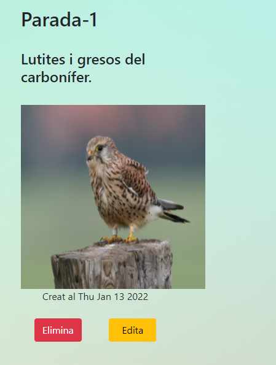

# Geo-app 2.0

## Node.js-Express-EJS-Mongodb Rest api with user authentification using express session.


* Geo-app 2.0 allows the user to create edit and delete their own locations, descriptions and images on a geological,  orthographic and topographic maps being able to consult the geologic description from the ICGC WMS using GetFeatureInfo. Deployed on AWS.

[https://www.geoatles.cat/auth/login](https://www.geoatles.cat/auth/login)

[https://geoatles.cat/](https://geoatles.cat/auth/login)

```bash
# Server on localhost:5000
nodemon 
or
npm start

# Routes (development)
User positions	         http://localhost:5000
Register                 http://localhost:5000/auth/register
Login                    http://localhost:5000/auth/login
Create position          http://localhost:5000/positions/store
Get one position         http://localhost:5000/position/:id
Delete one postition     http://localhost:5000/positions/delete/:id
Update one positions     http://localhost:5000/positions/update/:id

# Database (development, Mongodb Compass)
mygeodatabase
```
<br>

<br>

Geologic WMS for GetFeatuesInfo: https://geoserveis.icgc.cat/arcgis/services/geologic/icgc_mg50m/MapServer/WMSServer? <br>

Source: [https://www.icgc.cat/Administracio-i-empresa/Serveis/Geologia/WMS-Cartografia-geologica](https://www.icgc.cat/Administracio-i-empresa/Serveis/Geologia/WMS-Cartografia-geologica)

<p align="center">



</p>


mongodb atlas user permissions: danc 123